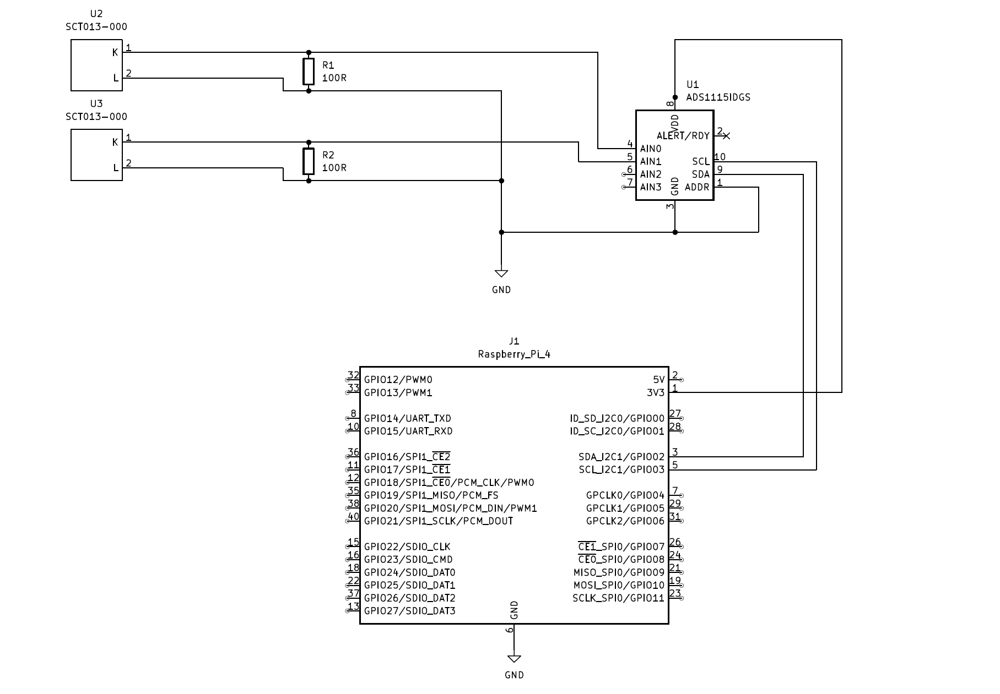

# power_meter

`power_meter` reads current data from CT sensors through an `ADS1115` ADC, converts the sampled voltage into estimated power, and pushes the result to Zabbix with the `history.push` API.

## Overview

The application is designed for a small Raspberry Pi style deployment that measures two power lines and records them in Zabbix.

At runtime it:

1. Opens the I2C bus and initializes the `ADS1115`.
2. Reads channel `0` for about one second and calculates RMS voltage.
3. Converts that voltage into estimated current and power.
4. Pushes the result to a Zabbix item.
5. Repeats the same process for channel `1`.
6. Appends the Zabbix API responses to a local log file.

## Architecture

### Hardware

The measurement hardware is built around a Raspberry Pi 4B and a small custom interface board shown in the photos below.

- The Raspberry Pi 4B is the main controller. It runs the Python application, communicates with the ADC over I2C, and sends the measured values to Zabbix over the network.
- Up to four CT sensors can be connected to the board through the audio-jack style connectors. These CT sensors clamp around AC lines and produce analog signals proportional to line current.
- The analog signals from the CT sensors are routed into an `ADS1115`, which performs analog-to-digital conversion.
- The `ADS1115` sends sampled values to the Raspberry Pi through the I2C bus.
- The software currently reads two channels in the main flow, but the hardware and channel helper support up to four ADS1115 inputs.

In practical terms, the signal path is:

```text
AC line -> CT sensor -> interface board -> ADS1115 -> I2C -> Raspberry Pi -> power_meter -> Zabbix
```

The Python code treats the ADC inputs as voltage measurements from the CT sensor circuit. It then calculates RMS voltage over a one-second sampling window and converts that into estimated current and power using the calibration constants currently hard-coded in `power_meter/lib/ct_sensor.py`.

The hardware photos show:
- Circuit diagram
- Overall assembled unit
- Front side of the HAT / interface board
- Back side of the HAT / interface board




#### BOM
| Part                 | URL                          |
| -------------------- | ---------------------------- |
| Raspberryi PI 4B 8MB | https://amzn.asia/d/09VkZCds |
| CT sensor + ADS1115  | https://amzn.asia/d/09E6AdKU |
| Addtional CT sensor  | https://amzn.asia/d/0j46FoEJ |


### Software
#### Entry point

- `power_meter/__main__.py`
  Runs the package as `python -m power_meter`.
- `power_meter/cli.py`
  Main application flow. Coordinates sensor setup, sampling, Zabbix upload, and log writing.

#### Sensor layer

- `power_meter/lib/ct_sensor.py`
  Contains the hardware-facing logic:
  - `initialize_ads1115()`: creates the I2C bus and configures the ADC.
  - `get_channel(ads, channel)`: maps channel numbers `0-3` to ADS1115 pins.
  - `read_power(chan)`: samples voltage for one second, computes RMS voltage, and converts it to Watts.

Current power conversion is based on fixed assumptions in code:

- CT ratio equivalent: `20A / 1V`
- Burden resistor: `100 Ohm`
- Supply voltage (to convert current to power): `100V`

The calculation is:

```text
current = rms_voltage * 2000 / 100
power = current * 100
```

#### Zabbix integration

- `power_meter/lib/zabbix_api.py`
  Builds and sends a JSON-RPC `history.push` request to Zabbix using `requests`.

Required environment variables:

- `ZABBIX_API_URL`
- `ZABBIX_API_TOKEN`

#### Tests

- `test/test_ct_sensor.py`
  Unit tests for channel selection and power conversion with mocked hardware modules.
- `test/test_zabbix_api.py`
  Unit tests for Zabbix API calls and log writing.
- `test/hardware/`
  Manual scripts intended for hardware verification on the target device.

## Data flow

```text
CT sensor -> ADS1115 -> ct_sensor.read_power() -> cli.main() -> zabbix_api.call_zabbix_api2() -> Zabbix
                                                              -> log file
```

## Channel mapping

The current application records two channels:

- Channel `0` -> Zabbix item ID `69140`
- Channel `1` -> Zabbix item ID `69142`

These mappings are currently hard-coded in `power_meter/cli.py`.

## Prerequisites

This repository assumes a Linux device with:

- Python 3
- I2C enabled
- An `ADS1115` connected and accessible from Python
- CT sensors wired to the expected ADC channels
- Network access to the Zabbix API endpoint

Python packages used by the code:

- `requests`
- `adafruit-circuitpython-ads1x15`
- `board` support for the target platform
- `pytest` for tests

## Setup

Create the environment variables before running:

```bash
export ZABBIX_API_URL="https://your-zabbix.example/api_jsonrpc.php"
export ZABBIX_API_TOKEN="your-token"
```

Create the log directory expected by the current implementation:

```bash
mkdir -p log
```

Install the Python dependencies in your environment, then run:

```bash
python -m power_meter
```

## What happens when you run it

Running `python -m power_meter` will:

1. Initialize the ADS1115 over I2C.
2. Sample channel `0` for one second and send the calculated power to Zabbix item `69140`.
3. Sample channel `1` for one second and send the calculated power to Zabbix item `69142`.
4. Write both API responses to `./log/zabbix_api_log_YYYYMMDD.txt`.

## Running tests

Run the unit tests with:

```bash
pytest
```

Note that tests under `test/hardware/` are hardware-oriented scripts and may require the real device setup.

## Current limitations

- Zabbix item IDs are hard-coded.
- Only channels `0` and `1` are used by the main flow.
- Logging is file-based and the log directory must already exist.
- Error handling is minimal.
- Calibration values are embedded in code rather than configuration.
